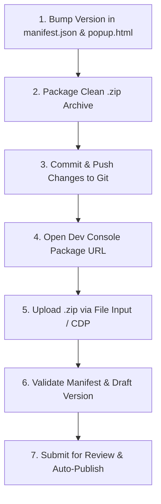

# Chrome Extension Deployment Guide

This guide provides the complete, end-to-end process for building, packaging, versioning, and deploying **Claude Pulse** (or any Manifest V3 Chrome Extension) to the **Chrome Web Store Developer Console**.

---

## 🏗️ Architecture & Deployment Flow



---

## 📋 Prerequisites

1. **Chrome Web Store Developer Account**: Active developer account at [Chrome Web Store Dev Console](https://chrome.google.com/webstore/devconsole).
2. **Item ID**: Your registered extension item ID (e.g., `hhjihbpkopgacncfbkdakdolkmgkdfnf`).
3. **Publisher ID**: Your developer account identifier (e.g., `50a0ee3a-650f-4c5e-86b0-1f529fedff8b`).
4. **Standard Build Tools**: `zip`, `git`, `node` (if running automated verification).

---

## 🚀 Step-by-Step Deployment Process

### Step 1: Bump Version Numbers

Update the version string according to [Semantic Versioning](https://semver.org/) (`MAJOR.MINOR.PATCH`).

1. **`manifest.json`**:
   ```json
   {
     "manifest_version": 3,
     "name": "Claude Pulse",
     "version": "1.4.0",
     ...
   }
   ```
2. **`src/popup/popup.html`** (if displaying version in UI):
   ```html
   <span class="pp-version">1.4.0</span>
   ```

---

### Step 2: Build a Clean Zip Archive

Chrome Web Store requires a `.zip` archive containing the `manifest.json` at the root level of the archive. Extraneous files (like `.git`, `.DS_Store`, or `tmp/`) must be omitted.

Run the following command from the project root:

```bash
# Remove existing zip and build clean archive
rm -f claude-pulse.zip && zip -r claude-pulse.zip manifest.json icons src -x "*.DS_Store"
```

#### Verification:
Ensure the zip contains all required assets:
```bash
unzip -l claude-pulse.zip
```
Expected output structure:
```text
manifest.json
icons/
icons/icon16.png
...
src/
src/background/service-worker.js
src/content/
src/popup/
src/styles.css
```

---

### Step 3: Git Commit & Push

Always sync your repository with the new release version and tag:

```bash
git add manifest.json src/ DEPLOYMENT.md
git commit -m "chore: bump version to 1.4.0 for Chrome Web Store release"
git pull --rebase origin main
git push origin main
```

---

### Step 4: Chrome Web Store Dev Console Upload

#### Direct Package Management URL
Use the direct package URL with your Google account index (`/u/0/` or `/u/1/`):
```text
https://chrome.google.com/u/1/webstore/devconsole/<PUBLISHER_ID>/<EXTENSION_ID>/edit/package
```

*Example for Claude Pulse:*
```text
https://chrome.google.com/u/1/webstore/devconsole/50a0ee3a-650f-4c5e-86b0-1f529fedff8b/hhjihbpkopgacncfbkdakdolkmgkdfnf/edit/package
```

#### Uploading & Submitting:
1. Click **"Upload new package"** and select `claude-pulse.zip`.
2. Wait for Google's validation check to pass.
3. Verify the **Draft version** displays the new version (`1.4.0`).
4. Click the blue **"Submit for review"** button in the top-right corner.
5. In the confirmation dialog:
   - Ensure **"Publish automatically once approved"** is checked.
   - Enter any reviewer notes if prompted (e.g., "Updated UI selectors for claude.ai").
6. Click **Submit**.
7. Confirm status changes to **"Pending review"**.

---

## 🤖 Automated Deployment Methods

### Method 1: AI Browser Subagent (`/browser`)

You can instruct the Antigravity assistant to automate the entire release process using Chrome DevTools Protocol (CDP):

```text
/browser Please bump version to 1.4.0, build the zip package, commit and push to git, and upload to the Chrome Web Store Dev Console at https://chrome.google.com/u/1/webstore/devconsole/... and submit for review.
```

The agent will:
1. Edit the source code and build `claude-pulse.zip`.
2. Connect to your active Chrome browser session.
3. Navigate directly to the package page and set the file on the hidden `<input type="file">` element.
4. Verify the version update and trigger the submission.

---

### Method 2: Local Playwright / Puppeteer Script

If you want a standalone local Node.js script that connects to your existing logged-in Chrome profile:

```javascript
// deploy.js
const { chromium } = require('playwright');
const path = require('path');

const PUBLISHER_ID = '50a0ee3a-650f-4c5e-86b0-1f529fedff8b';
const EXTENSION_ID = 'hhjihbpkopgacncfbkdakdolkmgkdfnf';
const ZIP_PATH = path.resolve(__dirname, 'claude-pulse.zip');

(async () => {
  // Launch with your user data dir to maintain Google authentication
  const context = await chromium.launchPersistentContext(
    path.join(process.env.HOME, 'Library/Application Support/Google/Chrome/Default'),
    {
      headless: false,
      channel: 'chrome',
      args: ['--profile-directory=Profile 1'] // adjust to match your Google profile
    }
  );

  const page = await context.newPage();
  const packageUrl = `https://chrome.google.com/u/1/webstore/devconsole/${PUBLISHER_ID}/${EXTENSION_ID}/edit/package`;
  
  console.log(`Navigating to ${packageUrl}...`);
  await page.goto(packageUrl, { waitUntil: 'networkidle' });

  // Locate the file input and upload
  const fileInput = page.locator('input[type="file"]');
  await fileInput.setInputFiles(ZIP_PATH);

  // Wait for package validation
  console.log('Waiting for package validation...');
  await page.waitForSelector('text=Draft version', { timeout: 60000 });

  // Click Submit for Review
  const submitBtn = page.locator('button:has-text("Submit for review")');
  await submitBtn.click();

  // Confirm modal if present
  const confirmBtn = page.locator('button:has-text("Submit")');
  if (await confirmBtn.isVisible()) {
    await confirmBtn.click();
  }

  console.log('Successfully submitted for review!');
  await context.close();
})();
```

---

### Method 3: GitHub Actions CI/CD (Chrome Web Store API)

For full hands-off CI/CD on every Git tag, use Google's official Chrome Web Store API:

```yaml
# .github/workflows/deploy.yml
name: Deploy Extension

on:
  push:
    tags:
      - 'v*'

jobs:
  build-and-upload:
    runs-on: ubuntu-latest
    steps:
      - uses: actions/checkout@v4

      - name: Build zip bundle
        run: zip -r claude-pulse.zip manifest.json icons src -x "*.DS_Store"

      - name: Upload & Release to Chrome Web Store
        uses: mnao305/chrome-extension-upload@v5.0.0
        with:
          file-path: claude-pulse.zip
          extension-id: ${{ secrets.CHROME_EXTENSION_ID }}
          client-id: ${{ secrets.CHROME_CLIENT_ID }}
          client-secret: ${{ secrets.CHROME_CLIENT_SECRET }}
          refresh-token: ${{ secrets.CHROME_REFRESH_TOKEN }}
          publish: true
```

---

## ⚠️ Common Gotchas & Troubleshooting

| Issue | Root Cause | Solution |
|---|---|---|
| **Google Re-authentication / 2FA Prompt** | Google session expired or account index mismatch. | Use `/u/1/` (or the correct index) in the URL and complete any pending 2FA prompts in your browser. |
| **"Manifest is not at root" Error** | Zipping the parent folder instead of its contents. | Run `zip -r bundle.zip manifest.json src icons` directly from the directory containing `manifest.json`. |
| **"Version already exists" Error** | Forgot to bump version number in `manifest.json`. | Increment the version in `manifest.json` before building the zip. |
| **Review Delayed / Rejected** | Requested broad permissions without clear usage in privacy policy. | Ensure `PRIVACY.md` explains all permissions (`storage`, `alarms`, `notifications`). |
